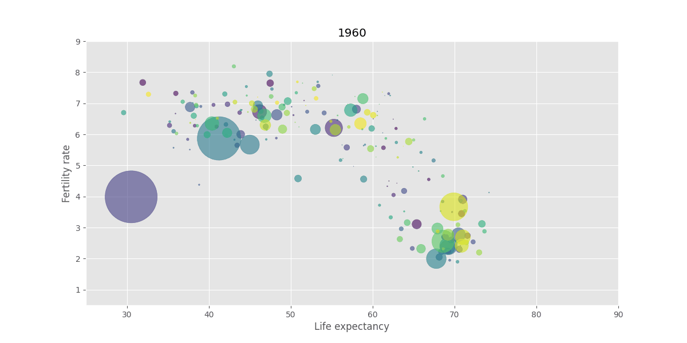

# Gapminder

This is a small project to learn basics of panda and to visualize the gapminder data.

Given three unclean data set with the data of population size, fertility rate and life expectancy of many countries over many years (1800 - 2016) which are not complete.

Clean the data and make a nice plot.

## Installation

* Create a new environment and install the requirements, e.g.

    conda create -n test python=3.11
    
* Install the requirements and jupyterlab.

    pip install -r requirements.txt
    conda install jupyterlab
    
* Open gapminder.ipynb in jupyterlab to see a solution.